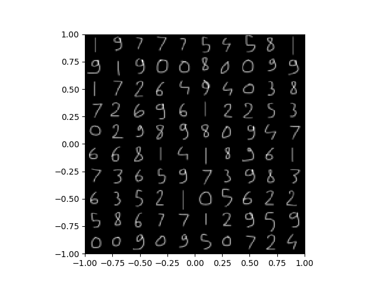
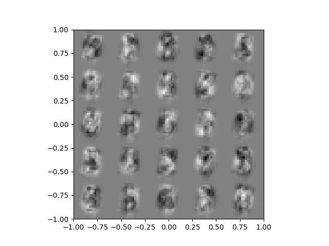
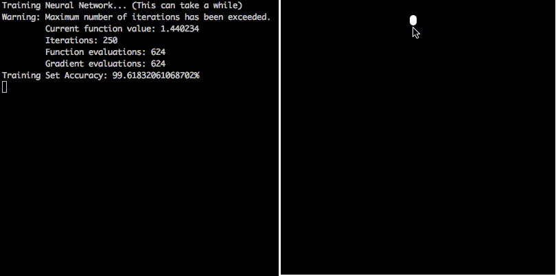

# Digit Recognizer

About
-----
> Neural Network Implementation in Python for Digit Recognition

My first implementation of a Neural Network with numpy and using an optimizer function from scipy.

Installation
------------
Run `python3 -m pip install -r requirements.txt`

Usage
-----
Execute with `python3 train_neural_network.py`

You will see the current state of the database:

  

Then, you will be asked to write some digits from 1 to 10. (Closing the windows without writing anything will skip this part).

You can now train the Neural Network to your own handwriting !

You can even see how the Neural Network "see" your digits:

  

### Example

  

##### Project done in 2019
